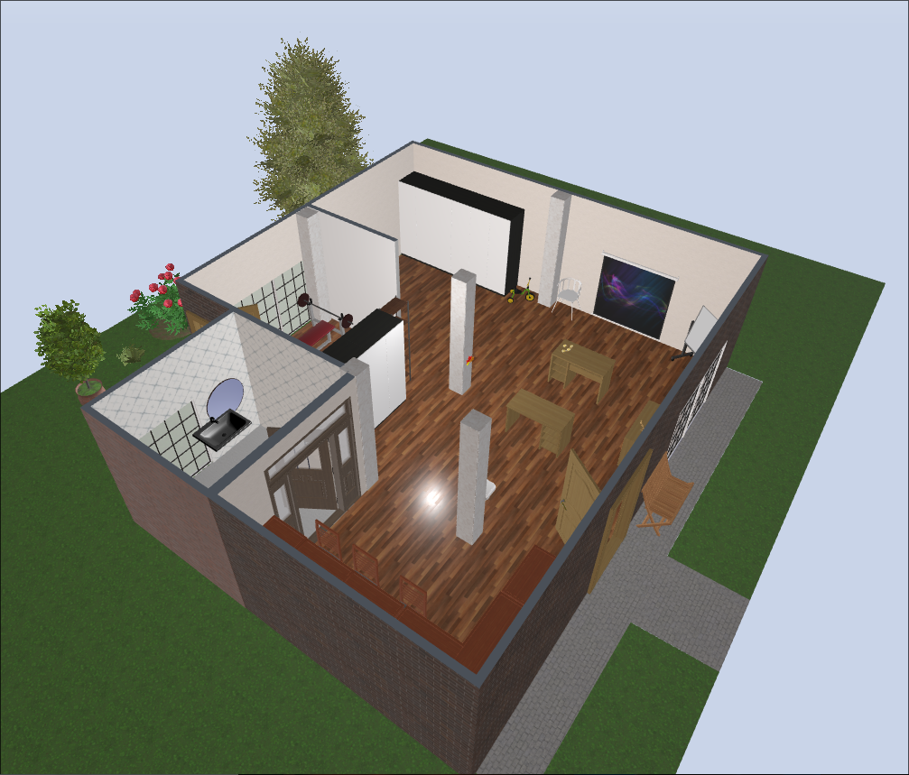

# 📚 SIDAUTO BIBLIOTECA



Una página web moderna e interactiva para la biblioteca comunitaria SIDAUTO, ubicada en el corazón de Bogotá.

## 🌟 Características

### 🏢 Información Principal
- **Nombre**: SIDAUTO BIBLIOTECA
- **Ubicación**: Calle 93 # 89a-27 Plan, Bogotá, Cundinamarca
- **Misión**: Espacio de conocimiento y aprendizaje comunitario

### ✨ Funcionalidades

#### 🏠 Página Principal
- Diseño moderno y responsivo
- Información de contacto y ubicación
- Descripción atractiva de servicios

#### 🏗️ Recorrido Virtual 3D
- Integración con Planner5D
- Vista previa interactiva del espacio
- Acceso directo al recorrido completo

#### 📖 Biblioteca Virtual
- Colección de 8 libros clásicos de literatura
- Portadas reales obtenidas de Open Library
- Sistema de búsqueda y navegación intuitiva
- Tarjetas interactivas con información detallada

#### 🎨 Diseño y UX
- **Navegación suave** con scroll animado
- **Efectos hover** y transiciones elegantes
- **Diseño responsivo** para móviles y escritorio
- **Favicon personalizado** con tema de biblioteca
- **Colores profesionales** (azul y gris)

## 🛠️ Tecnologías Utilizadas

- **HTML5**: Estructura semántica y accesible
- **CSS3**: Diseño moderno con gradientes y animaciones
- **JavaScript ES6+**: Interactividad y manejo de APIs
- **Planner5D**: Recorrido virtual 3D
- **Open Library API**: Portadas de libros reales

## 📁 Estructura del Proyecto

```
├── index.html          # Página principal
├── style.css           # Estilos CSS
├── script.js           # Funcionalidad JavaScript
├── assets/
│   ├── libro.png                    # Favicon
│   └── 2025-09-10-194831_hyprshot.png  # Imagen del proyecto 3D
└── README.md           # Documentación
```

## 🚀 Instalación y Uso

1. **Clona el repositorio**:
   ```bash
   git clone https://github.com/Kalytheos/Sidauto.git
   ```

2. **Navega al directorio**:
   ```bash
   cd Sidauto
   ```

3. **Abre en tu navegador**:
   - Abre `index.html` directamente en tu navegador
   - O usa un servidor local como Live Server

## 📖 Biblioteca Virtual

### Libros Incluidos:
1. **Cien años de soledad** - Gabriel García Márquez
2. **Don Quijote de la Mancha** - Miguel de Cervantes
3. **El Amor en los Tiempos del Cólera** - Gabriel García Márquez
4. **La Casa de los Espíritus** - Isabel Allende
5. **El Túnel** - Ernesto Sabato
6. **Rayuela** - Julio Cortázar
7. **Pedro Páramo** - Juan Rulfo
8. **Crónica de una Muerte Anunciada** - Gabriel García Márquez

## 🎯 Características Técnicas

### Responsive Design
- ✅ Móviles (320px+)
- ✅ Tablets (768px+)
- ✅ Escritorio (1024px+)

### Compatibilidad
- ✅ Chrome/Chromium
- ✅ Firefox
- ✅ Safari
- ✅ Edge

### Performance
- ⚡ Carga rápida con imágenes optimizadas
- 🔄 Lazy loading para mejor rendimiento
- 📱 Optimizado para dispositivos móviles

## 🔮 Próximas Funcionalidades

- [ ] Sistema de búsqueda avanzada
- [ ] Base de datos de libros expandida
- [ ] Sistema de reservas online
- [ ] Chat en vivo para consultas
- [ ] Blog de noticias y eventos
- [ ] Integración con redes sociales

## 👥 Contribuciones

Las contribuciones son bienvenidas. Por favor:

1. Fork el proyecto
2. Crea una rama para tu feature (`git checkout -b feature/AmazingFeature`)
3. Commit tus cambios (`git commit -m 'Add some AmazingFeature'`)
4. Push a la rama (`git push origin feature/AmazingFeature`)
5. Abre un Pull Request

## 📄 Licencia

Este proyecto está bajo la Licencia MIT - ver el archivo [LICENSE](LICENSE) para más detalles.

## 📞 Contacto

**SIDAUTO BIBLIOTECA**
- 📍 Calle 93 # 89a-27 Plan, Bogotá, Cundinamarca
- 🌐 [GitHub Repository](https://github.com/Kalytheos/Sidauto)

---

⭐ **¡Dale una estrella al proyecto si te gusta!** ⭐
